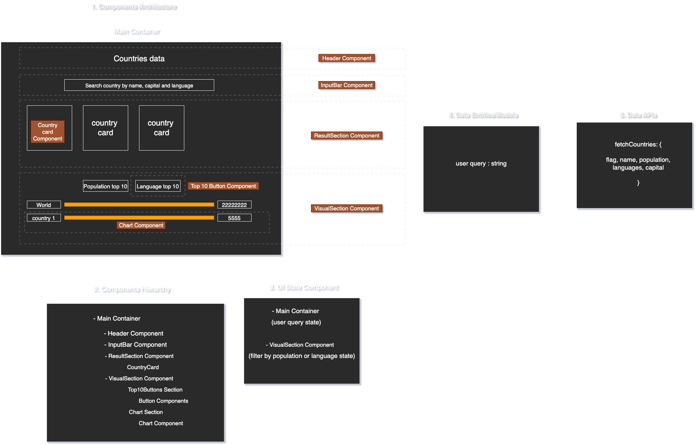
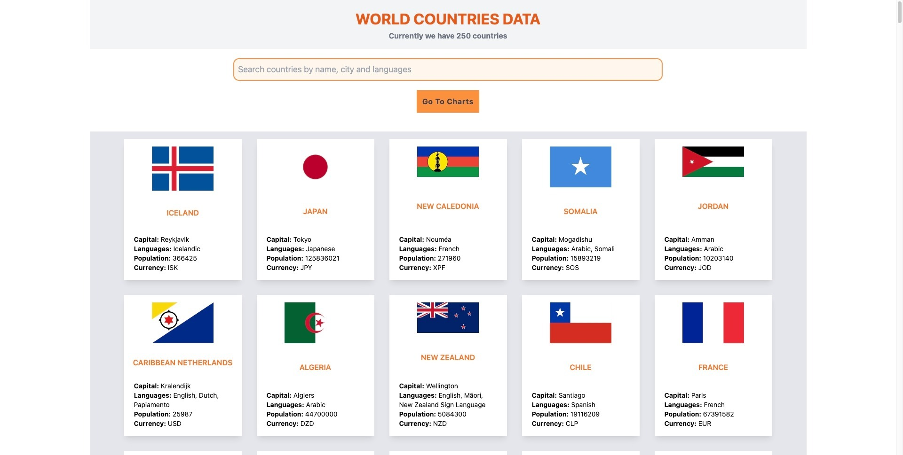
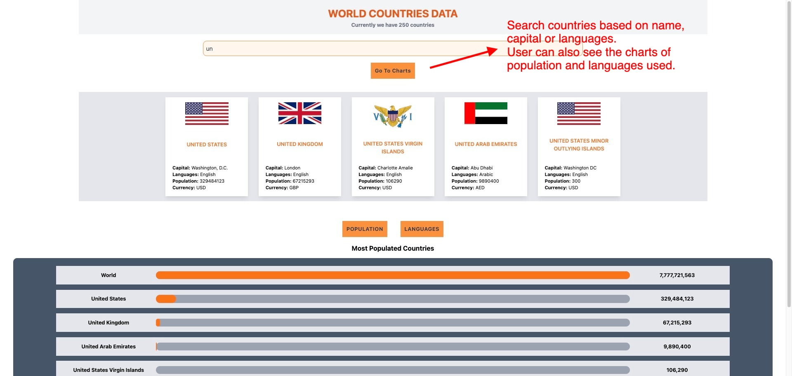

### API Used-

https://restcountries.com/v3.1/all

## User can search countries by- name, capital & languages

🚀[App Demo]('https://gunvant8008.github.io/countries-visual-data-react-tcss/')

Here is component architecture-

App Screen Shots-

